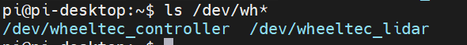
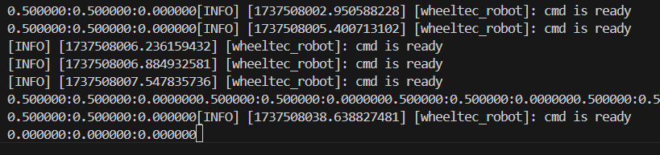
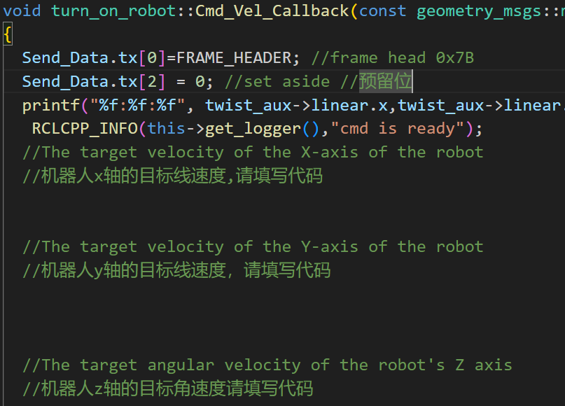

# <center>基于T-bot底盘实验指导书---话题订阅
## 1.考核目标

### 1.1 实验原理
本实验主要考核消息的订阅功能的理解与应用。在 ROS（机器人操作系统）中，机器人通过消息传递进行节点之间的通信。通过小乌龟实验，我们了解到通过键盘控制小乌龟的运动，其核心在于 ROS 系统中存在一个节点teleop_twist_keyboard，产生了话题 `/cmd_vel` 。小乌龟订阅了 `/cmd_vel` 话题后，能够根据接收到的速度指令进行运动。因此，通过订阅 `/cmd_vel` 消息，我们可以实现机器人的运动控制。
- **结点运行**
输入如下指令
ros2 run teleop_twist_keyboard teleop_twist_keyboard
启动键盘控制结点，该结点是系统默认自带的，不需要我们去编写这个结点。

- **消息类型**
 单独打开终端，通过查看/cmd_vel，终端中输入ros2 topic info /cmd_vel获得该话题的类型<br>Type:geometry_msgs/msg/Twist
 Publisher count: 1
 Subscription count: 0
 关于twist指令可以参考[twist官方解释](https://docs.ros.org/en/jazzy/p/geometry_msgs/interfaces/msg/Twist.html)


### 1.2 实验目标
- **创建消息订阅者**：制作一个 ROS 节点，订阅 `/cmd_vel` 消息。
- **实现小车移动控制**：根据接收到的速度和角度指令，实现小车的移动控制。
- **验证响应能力**：测试小车在不同速度和方向命令下的响应能力，确保其能够按预期进行移动。
- **数据记录与分析**：记录实验过程中小车的运动数据，以便进行后续分析。

## 2.实验步骤

### 2.1创建包

首先在 ~/ros2_ws/src 目录创建一个名为 my_base 的包：
cd ~/ros2_ws/src 
ros2 pkg create --build-type ament_cmake my_base
### 2.2编写订阅者节点代码
新建一个CPP文件，命名为my_base.cpp,文件引用头文件bot_serial.h，该头文件中定义了下发指令的结构体和基本类
```c++
#define SEND_DATA_CHECK   1         
#define READ_DATA_CHECK   0          
#define FRAME_HEADER      0X7B       //Frame head 
#define FRAME_TAIL        0X7D       //Frame tail 
#define RECEIVE_DATA_SIZE 24        
#define SEND_DATA_SIZE    11         
#define PI 				        3.1415926f //PI //圆周率
typedef struct _SEND_DATA_  
{
	  uint8_t tx[SEND_DATA_SIZE];
		float X_speed;	       
		float Y_speed;           
		float Z_speed;         
		unsigned char Frame_Tail; 
}SEND_DATA;
```
该结构体描述了ROS系统下发指令的详细细节，分析可知，控制X轴、y轴、Z轴速度的下发
便可以完成移动底盘运动的控制。
```c++
class turn_on_robot : public rclcpp::Node
{
  public:
    turn_on_robot();  //Constructor //构造函数
    ~turn_on_robot(); //Destructor //析构函数
    void Control();   //Loop control code //循环控制代码
    serial::Serial Stm32_Serial; //Declare a serial object //声明串口对象 
  private:
    rclcpp::Time _Now, _Last_Time;  //Time dependent, used for 
    float Sampling_Time;         
    RECEIVE_DATA Receive_Data; 
    SEND_DATA Send_Data;       
    bool Get_Sensor_Data_New();
    unsigned char Check_Sum(unsigned char Count_Number,unsigned char mode);
    //check function //校验函数
    short IMU_Trans(uint8_t Data_High,uint8_t Data_Low);  
    //IMU data conversion read //IMU数据转化读取
    float Odom_Trans(uint8_t Data_High,uint8_t Data_Low); 
    //Odometer data is converted to read //里程计数据转化读取    
  };
```

为了建立底盘与ROS系统之间的联系，有必要建立一个类，并在内中定义串口接`serial::Serial Stm32_SerialStm32_Serial`,其中`Get_senosr_Data_New()`函数与`Check_Sum()`函数不属于考核点，老师已经实现了，直接调用即可。学生需要完成类的构造函数`turn_on_robot()`和`Control()`函数

my_base.c主要由四个函数，请将以下四个函数拷贝到文件中，并实现缺失的代码。
- ***函数1*** 
```c++
#include "bot_serial.h"
int main(int argc, char **argv) {
    rclcpp::init(argc, argv);
    turn_on_robot Robot_Control;//Instantiate an object //实例化一个对象
    Robot_Control.Control();
    rclcpp::shutdown();
    return 0;
}

```
- ***函数2***
可见，我们同时需要在my_base.c文件中需要实现Robot_Control.Control()函数，该函数的模板如下：
```C++
void turn_on_robot::Control()
{ 
    while(rclcpp::ok())
    {
        try
        {
            rclcpp::spin_some(this->get_node_base_interface());  
        }
        catch (const rclcpp::exceptions::RCLError & e )
        {
            RCLCPP_ERROR(this->get_logger(),"unexpectedly failed whith %s",e.what());	
        }
    }
}
```
- ***函数3***
我们需要重点完成的是订阅完消息后的回调函数如何实现
```c++
void turn_on_robot::Cmd_Vel_Callback(const geometry_msgs::msg::Twist::SharedPtr twist_aux)
{
  Send_Data.tx[0]=FRAME_HEADER; //frame head 0x7B 
  Send_Data.tx[2] = 0; //set aside //预留位
  printf("%f:%f:%f", twist_aux->linear.x,twist_aux->linear.x,twist_aux->angular.z);
   RCLCPP_INFO(this->get_logger(),"cmd is ready"); 
  //The target velocity of the X-axis of the robot
  //机器人x轴的目标线速度,请填写代码
  

  //The target velocity of the Y-axis of the robot
  //机器人y轴的目标线速度，请填写代码

  

  //The target angular velocity of the robot's Z axis
  //机器人z轴的目标角速度请填写代码

//   Send_Data.tx[9]=Check_Sum(9,SEND_DATA_CHECK); 
//   Send_Data.tx[10]=FRAME_TAIL; //frame tail 0x7D
//   try
//   {
//     Stm32_Serial.write(Send_Data.tx,sizeof (Send_Data.tx)); 
//   }
//   catch (serial::IOException& e)   
//   {
//     RCLCPP_ERROR(this->get_logger(),("Unable to send data through serial port")); 
//   }
}
```
- ***函数4***
```c++
turn_on_robot::turn_on_robot():rclcpp::Node ("wheeltec_robot")
{

    Cmd_Vel_Sub = create_subscription<geometry_msgs::msg::Twist>(
    "cmd_vel", 2, std::bind(&turn_on_robot::Cmd_Vel_Callback, this, _1));
     RCLCPP_INFO(this->get_logger(),"wheeltec_robot Data ready"); //Prompt message //提示信息
    // try
    // { 
    //     Stm32_Serial.setPort("/dev/ttyACM0"); //Select the serial port number to enable //选择要开启的串口号
    //     Stm32_Serial.setBaudrate(115200); //Set the baud rate //设置波特率
    //     serial::Timeout _time = serial::Timeout::simpleTimeout(2000); //Timeout //超时等待
    //     Stm32_Serial.setTimeout(_time);
    //     Stm32_Serial.open(); //Open the serial port //开启串口
    // }
    // catch (serial::IOException& e)
    // {
    //     RCLCPP_ERROR(this->get_logger(),"wheeltec_robot can not open serial port,Please check the serial port cable! "); //If opening the serial port fails, an error message is printed //如果开启串口失败，打印错误信息
    // }
    // if(Stm32_Serial.isOpen())
    // {
    //     RCLCPP_INFO(this->get_logger(),"wheeltec_robot serial port opened"); //Serial port opened successfully //串口开启成功提示
    // }
}
```

## 2.3修改package.xml
进入ros2_ws/src/my_base目录并打开package.xml，按照之前教程要求填写description ，maintainer和license.<u>如果你并不想开源你的代码，可以忽略此步。</u>

```xml
  <description>TODO: Package description</description>
  <maintainer email="nxrobo@todo.todo">nxrobo</maintainer>
  <license>TODO: License declaration</license>
```
  在编译工具依赖ament_cmake后
  ```xml
   <buildtool_depend>ament_cmake</buildtool_depend>
  ```
  添加下列依赖项：
```xml
  <depend>rclcpp</depend>
  <depend>std_msgs</depend>
```
改写完毕后注意记得保存文档!
## 2.4修改CmakeLists.txt
打开 CMakeLists.txt ，在 find_package(ament_cmake REQUIRED) 下添加两行：
```
find_package(rclcpp REQUIRED)
find_package(geometry_msgs REQUIRED)
find_package(tf2_geometry_msgs REQUIRED)
find_package(serial REQUIRED)

add_executable(my_base src/my_base.cpp)
ament_target_dependencies(my_base rclcpp serial tf2_geometry_msgs)
```
然后在添加可执行文件需要编译的源文件，并命名为 talker或者其他你认为合适的名字
```

```
# 3.编译运行
打开终端，执行如下命令：
执行colcon build
执行 source install/setup.bash
执行 ros2 run my_base my_base
# 4.测试验证
上述步骤正确，再打开终端，启动键盘节点，输入指令，则my_base节点会响应，
如图所示：

# 5.回调函数中完成代码整合
如图所示，完成代码编写

# 6.实现通过键盘操作小车的目的